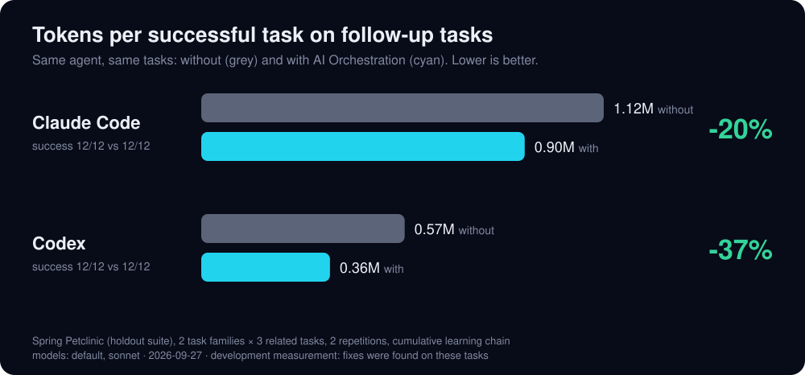
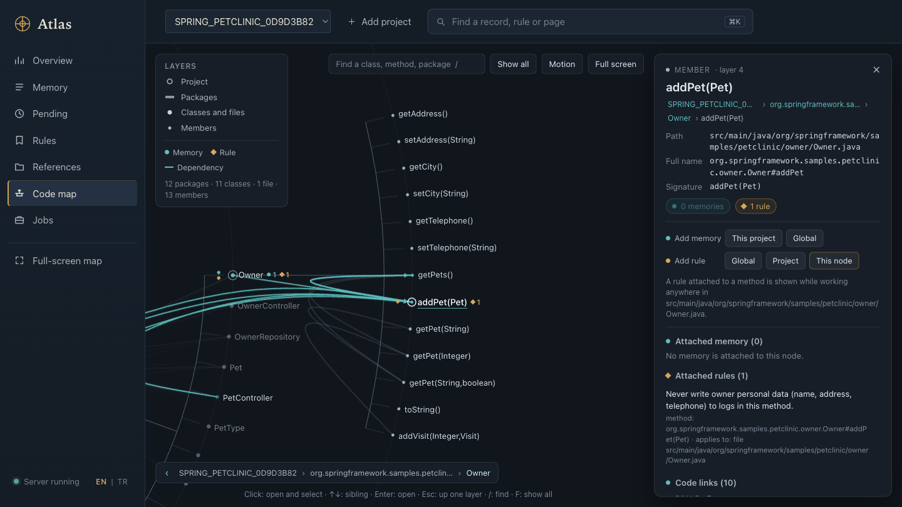

<div align="center">

# AI Orchestration

**Your coding agent forgets. AI Orchestration remembers.**

Project memory and rules for **Claude Code**, **Codex** and **GitHub Copilot** — local, one command to install.

[](https://github.com/ufukyuksel-dev/ai-orchestration/actions/workflows/ci.yml)
[](LICENSE)


<sub>Full-quality video: [docs/assets/promo.mp4](docs/assets/promo.mp4) · rendered from code by [tools/promo-video](tools/promo-video/)</sub>

</div>

Every new agent session starts from zero: it greps the same folders, rediscovers the same test command and steps on
the same pitfall. AI Orchestration is a small local server that fixes that. At the end of a task the agent saves a
short **card** — which files change together, the exact command that verified it, the pitfall. The next session on the
same repository starts from that card. Your **rules** — global, per project, or attached to a single method — reach
the agent exactly when it edits the code they are about.

## Benchmark

Same agent, same tasks, with and without AI Orchestration: six related tasks on Spring Petclinic, where the first task
of each family learns and the next two start from what it saved.

<p align="center"></p>

**Development measurement, not an independent one:** fixes to the product were found by looking at runs on these same
tasks. One repository, two task families, two repetitions per task; single tasks vary up to 2× between repetitions.

<!-- BENCHMARK:BEGIN (generated by tools/bench-chart/chart.py from the final run; do not edit by hand) -->
| Agent | Arm | Success | Follow-up tasks: tokens per success | First task (learns): mean tokens | All tasks: tokens per success | All tasks: $ per success | Follow-up turns |
|---|---|---|---|---|---|---|---|
| Claude Code | without | 12/12 | 1.12M | 1.39M | 1.21M | 0.53 | 27.9 |
| Claude Code | with AI Orchestration | 12/12 | 0.90M | 1.56M | 1.12M | 0.49 | 24.1 |
| | **difference** | | **-19.6%** | +11.8% | **-7.6%** | -8.1% | |
| Codex | without | 12/12 | 0.57M | 0.57M | 0.57M | — | — |
| Codex | with AI Orchestration | 12/12 | 0.36M | 0.60M | 0.44M | — | — |
| | **difference** | | **-36.7%** | +4.4% | **-22.9%** | — | |

Spring Petclinic (holdout suite), 2 task families × 3 related tasks, 2 repetitions, cumulative learning chain · models: default, sonnet · 2026-09-27 · development measurement: fixes were found on these tasks
<!-- BENCHMARK:END -->

Full method, per-task numbers and how to reproduce: [docs/benchmark.md](docs/benchmark.md).

## Install

```bash
git clone https://github.com/ufukyuksel-dev/ai-orchestration.git && cd ai-orchestration && ./install.sh
```

Needs **Docker**, **Ollama** and **Java 21+** (the installer tells you the one-line fix for anything missing). It
starts Postgres and Qdrant, pulls the `bge-m3` embedding model, runs the server as a background service on
`127.0.0.1:18080`, registers it with Claude Code and Codex and checks everything with `ai_orch doctor`. About a
minute plus downloads. Safe to re-run; `./install.sh --uninstall` removes it and keeps your data.

No chat model is needed: memory search uses local embeddings and code indexing is structural, so AI Orchestration
itself sends nothing off the machine.

## First five minutes

1. **Add a project.** Open `http://127.0.0.1:18080/` and give it a repository folder (or run
   `ai_orch project add <folder>`). It is indexed in seconds and the code graph opens.
2. **Teach once.** In that repository ask your agent: *"Find out how to run this project's tests and remember it."*
3. **Recall.** In a new session: *"Run the tests."* The agent starts from the card and runs the right command
   directly — in our run, 3 turns instead of 21.
4. **Attach a rule to code.** In the graph click a method → *Add rule → This node*: *"Never log personal data here."*
   The next time an agent edits that file, the rule is in its startup context.

The first session asks you once whether rules should load automatically; answer *always*.

<p align="center"></p>

## What you get

| | |
|---|---|
| **Memory** | Short cards the agent writes when a task taught something reusable; matched to the next task by meaning (works across languages). Exact duplicates are dropped; a card whose code changed is marked stale. |
| **Rules** | Global, per project, or bound to a directory, a file or a method. Every rule goes through a preview and your typed approval. Short rule sets travel inside the startup answer — no extra calls. |
| **Jobs** | A handoff note for the next session and named saved jobs, when you ask for them. |
| **Panel** | Memory, rules, pending proposals, references, jobs and the layered code graph — attach memory or rules to any node. |

How it works: [docs/how-it-works.md](docs/how-it-works.md) · Panel tour: [docs/panel.md](docs/panel.md)

## Agents

| Agent | How it connects |
|---|---|
| **Claude Code** | MCP server `ai-orchestration` (three tools), two hooks in `~/.claude/settings.json` — rules and matching cards arrive with your request; at the end of a task that changed code the agent is asked once to save what it learned — and a short session block in `~/.claude/CLAUDE.md`. All added by the installer. |
| **Codex** | MCP server in `~/.codex/config.toml` + the same block in `~/.codex/AGENTS.md`. |
| **GitHub Copilot** | The `ai_orch` terminal command. Per repository: `ai_orch project add <folder> --copilot` writes the instructions into that repository's `.github/`. |

## Privacy

AI Orchestration runs on your machine and listens on `127.0.0.1` only. Memories and rules live in a local Postgres;
vectors in a local Qdrant; embeddings come from a local Ollama model. The server makes no outside calls. What it hands
to your agent — the rules and memory cards for the current task — becomes part of that agent's context, so it goes
wherever the agent sends its context (for Claude Code, Codex or Copilot: their model provider), like any file the
agent reads.

## Uninstall

```bash
./install.sh --uninstall      # service, agent registrations and instruction blocks removed; data kept
./install.sh --purge-data     # also deletes the database and vector volumes (asks first)
```

## License

[MIT](LICENSE)
